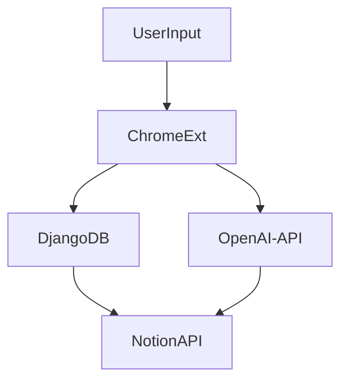

# GPT-Notion Chrome Extension

## Description
The `gpt-notion.chromeExt` is a Chrome extension that integrates Chat GPT and Notion. With this tool, you can instantly highlight any word or phrase in your browser, get an explanation from Chat GPT, and then save it directly to a specified Notion database. Perfect for quick research, vocabulary building, or just satisfying your curiosity on-the-go!

## Features
- **Instant Highlighting**: Highlight any word or phrase to trigger the extension.
- **GPT Explanation**: Get a brief explanation or definition from Chat GPT.
- **Direct Logging**: Save the highlighted word and its explanation to your Notion database with just a click.



## Installation
1. Clone this repository: 
   ```sh
   git clone https://github.com/your-username/gpt-notion.chromeExt.git
   ```
2. Open Chrome and go to `chrome://extensions/`.
3. Enable "Developer mode".
4. Click "Load unpacked" and select the directory where you cloned the repository.
5. The extension icon should appear in your Chrome toolbar.

## Usage
1. Highlight a word or phrase in your browser.
2. Click on the `gpt-notion.chromeExt` icon in your toolbar.
3. Review the GPT explanation in the popup.
4. Click "Save to Notion" to log the information to your database.

*local port must be open for the django server to work*

## Configuration
1. Connect to your Notion API by adding your Integration Token in the extension's options page.
2. Specify the database where you want to log the data.
